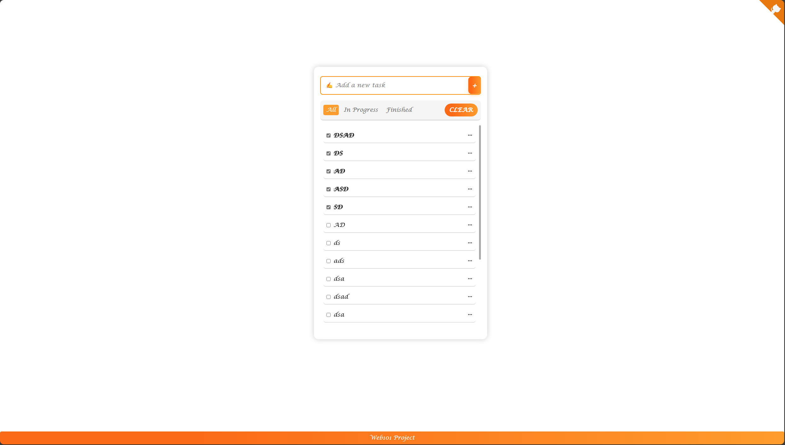

# 📝 TODO List App -  Reminder Homeworks

Reminder Homeworks is a simple and modern To-Do List web app designed for organizing homework and projects efficiently. It lets users `add`, `edit`, `delete`, and `mark tasks as completed`, with tasks stored locally for persistence.

With an intuitive UI, smooth animations, and filter options (**All**, **In Progress**, **Finished**), managing tasks becomes effortless.

---

## 🚀 Features

- ✅ **Task Management**: Add, edit, delete, and mark tasks as completed.
- 🔍 **Filters**: View tasks in three categories: **All**, **In Progress**, and **Finished**.
- 💾 **Persistent Storage**: Uses `localStorage` to retain tasks even after page reload.
- 🎨 **User-Friendly Interface**: Clean UI with animations and emoji-enhanced tasks.
- 🔗 **GitHub Integration**: Quick access to the project repository.

---

## 📸 Screenshot

---

## 🎨 UI Enhancements

- 🌟 **Soft shadow effects** for better visibility.
- 🎭 **Emoji-based** task representation.
- 🖱️ **Hover effects and animations** for smooth interactions.

---

## 🛠️ Technologies Used

- 🏗 **HTML5 & CSS3** – Responsive design.
- ⚡ **JavaScript (Vanilla JS)** – Task handling logic.
- 💽 **LocalStorage** – Data persistence.

---
